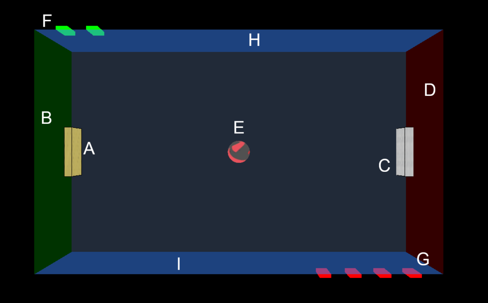

# Pong - Multimédia


## 📋 O Projektu

*   **Předmět:** Multimédia
*   **Autor:** Filip Charouzd & David Lelek
*   **Akademický rok:** 2025/2026
*   **Hra:** 3D-Pong

## 🎮 Popis Hry

Toto je replika implementace klasické arkádové hry **Pong**. Hra je určena pro dva hráče, přičemž druhého hráče můžete nahradit jednoduchá umělá inteligence (AI). Cílem hry je získat více bodů než soupeř tím, že míček odrazíte za jeho pálku.

**Účel projektu** bylo seznámit se s tvorbou interaktivních multimediálních aplikací, prací s grafikou, zvuky, obrazem a herní logikou.

## 🚀 Instalace a Spuštění

Hru si můžete velmi snadno spustit lokálně na svém počítači.

1.  **Stažení:** Stačí si stáhnout zdrojové kódy (např. jako ZIP a rozbalit, nebo naklonovat git repozitář).
2.  **Otevření složky:** Otevřete příkazový řádek (Terminal/CMD/PowerShell) v kořenové složce projektu.
3.  **Spuštění serveru:** Spusťte vestavěný Python server příkazem:
    ```bash
    python -m http.server 8000
    ```
    *(Pokud používáte Python 2, použijte příkaz `python -m http.server 8000`).*
4.  **Spuštění hry:** Ve svém prohlížeči přejděte na adresu:
    `http://localhost:8000`

5. **Vlastní customizace:** Před spuštěním serveru do media/img/ vlož své materiály. Ve windows powershell spušť script s právy pro spuštění `powershell.exe -ExecutionPolicy Bypass -File .\generate_list.ps1`. Aplikuj kroky 3 a 4

## 📖 Pravidla Hry a Ovládání

### Ovládání

| Hráč / Akce      | Klávesy                 |
| ---------------- | ----------------------- |
| **Hráč 1 (LEVÝ)** | `W` (nahoru), `S` (dolů) |
| **Hráč 2 (PRAVÝ)** | `↑` (nahoru), `↓` (dolů) |
| **Start míčku**  | `MEZERNÍK`              |

### Průběh hry

1.  **Před začátkem hry** si hráči v menu nastaví:
    *   Počet bodů potřebných k vítězství (**Počet gólů**).
    *   Vizuální vzhled pálky a míčku (**Skin**).
    *   Možnost zapnutí **AI** pro hru proti počítači.
2.  Hru odstartujete stisknutím **MEZERNÍKU**. Míček se vydá náhodným směrem.
3.  Hráči se snaží odrazit míček svými pálkami.
4.  Hráč **vstřelí gól**, pokud míček proletí za soupeřovu pálku.
5.  Hra končí, jakmile jeden z hráčů dosáhne nastaveného počtu gólů.

## 🏟️ Popis Hřiště

Následující obrázek znázorňuje jednotlivé elementy, se kterými se během hry setkáte.



**Vysvětlivky k obrázku:**
*   **A:** Hráč 1 (LEVÝ) - Skóre
*   **B:** Pálka Hráče 1
*   **C:** Míček
*   **D:** Pálka Hráče 2
*   **E:** Hráč 2 (PRAVÝ) - Skóre
*   **F:** Čára středového hřiště
*   **G:** Horní okraj hřiště
*   **H:** Dolní okraj hřiště
*   **I:** Cílová branka (gólová čára)

## 🙏 Poděkování

Děkuji všem hráčům, kteří si tuto hru vyzkoušeli!

Máte-li jakékoli návrhy, nápady na vylepšení nebo jste narazili na chybu, neváhejte mě kontaktovat na e-mailu: **xxx@yyyyy.zz**
